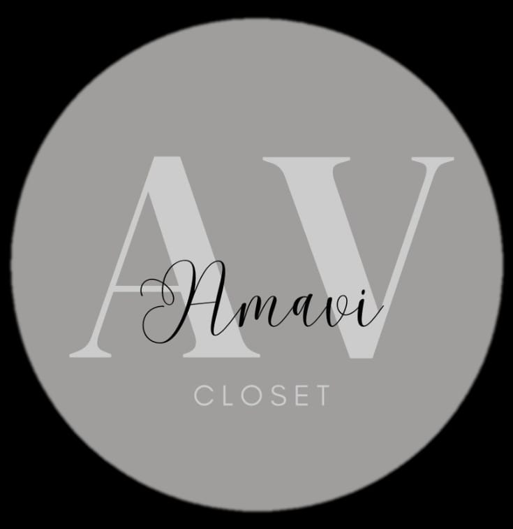

<h1 align="center">
  <br/>
  Projeto Amavi — Sistema Web de Gestão e E-commerce
</h1>

<p align="center">
  Desenvolvido pela <strong>LEADSYNC</strong> como Projeto de Extensão (PIM) do curso de<br/>
  Análise e Desenvolvimento de Sistemas — <strong>USCS, São Caetano do Sul · 2026</strong>
</p>

<p align="center">
  
  
  
  
  
  
  
  
  
</p>

---

## 📋 Sumário

1. [Sobre o Projeto](#-sobre-o-projeto)
2. [Sobre a Amavi](#-sobre-a-amavi)
3. [Funcionalidades](#-funcionalidades)
4. [Tecnologias Utilizadas](#-tecnologias-utilizadas)
5. [Estrutura do Projeto](#-estrutura-do-projeto)
6. [Telas Implementadas](#-telas-implementadas)
7. [Requisitos do Sistema](#-requisitos-do-sistema)
8. [Como Executar](#-como-executar)
9. [Equipe](#-equipe)

---

## 💡 Sobre o Projeto

O **Projeto Amavi** é uma solução tecnológica desenvolvida pela empresa de tecnologia **LEADSYNC** como Projeto Integrado Multidisciplinar (PIM) da USCS. O objetivo é digitalizar e profissionalizar a gestão de uma microempreendedora do setor de **moda feminina inclusiva**, centralizando em uma única plataforma web:

- Gestão de vendas e estoque
- Controle financeiro integrado
- Loja online com catálogo de produtos
- Ações de marketing digital com cupons e cashback
- Integração com WhatsApp e Instagram

A solução surgiu da observação real das dificuldades da loja Amavi, que operava de forma manual por meio de planilhas, Instagram e WhatsApp — sem nenhum sistema de gestão. O projeto visa transformar essa realidade e impulsionar o crescimento do negócio.

---

## 👗 Sobre a Amavi

A **Amavi** é uma loja de moda feminina com foco na **valorização de corpos reais**, oferecendo peças estilosas em tamanhos inclusivos e preços acessíveis. Gerida por empreendedoras apaixonadas pela marca, a Amavi tem como missão fazer com que toda mulher se sinta representada e bem-vestida.

**Desafios identificados antes do sistema:**

| Problema | Situação Atual |
|----------|----------------|
| Controle de vendas | Manual, via planilhas simples |
| Divulgação | Restrita ao círculo social no Instagram |
| Estoque | Desorganizado, sem alertas de baixa |
| Financeiro | Sem visão estratégica de lucros/despesas |
| Cupons e fidelização | Inexistentes |

---

## ⚙️ Funcionalidades

### 👩‍💼 Painel Administrativo (Empreendedora)

- ✅ Login seguro com autenticação por perfil
- ✅ Cadastro, edição e exclusão de produtos (com fotos, tamanhos, cores e preço)
- ✅ Controle de estoque em tempo real com alertas de baixa
- ✅ Registro de vendas online e offline
- ✅ Relatórios financeiros por período (entradas, saídas e lucro)
- ✅ Dashboard com indicadores de desempenho (produtos mais vendidos, lucro do mês)
- ✅ Gerenciamento de cupons de desconto e cashback
- ✅ Cadastro e controle de usuários/clientes

### 🛍️ Loja Online (Cliente Final)

- ✅ Cadastro de conta com nome, e-mail, telefone, CPF/CNPJ e senha
- ✅ Login e recuperação de senha
- ✅ Navegação e busca por produtos no catálogo
- ✅ Carrinho de compras com aplicação de cupons
- ✅ Finalização de pedido com confirmação automática via WhatsApp
- ✅ Programa de indicação com cashback

### 🔗 Integrações

- 📱 WhatsApp — confirmação de pedidos e comunicação com clientes
- 📸 Instagram — integração para divulgação e marketing digital

---

## 🛠️ Tecnologias Utilizadas

| Camada | Tecnologia | Finalidade |
|--------|------------|------------|
| **Front-end** | HTML5, CSS3, JavaScript | Estrutura, estilo e interatividade das páginas |
| **Front-end** | React | Interface dinâmica e componentizada |
| **Back-end** | PHP | Geração de páginas dinâmicas e integração com pagamentos |
| **Back-end** | Python | Automação de processos e inteligência do sistema |
| **Banco de Dados** | MySQL | Dados estruturados (produtos, vendas, cadastros) |
| **Banco de Dados** | MongoDB | Dados não estruturados (interações, recomendações) |
| **Design** | Figma | Prototipação de telas (baixa e média fidelidade) |
| **Versionamento** | Git + GitHub | Controle de versão e colaboração da equipe |
| **Editor** | VS Code, PyCharm | Desenvolvimento e depuração de código |
| **Ambiente** | Docker | Containerização e ambiente de testes |
| **Banco de Dados** | MySQL Workbench | Modelagem e gerenciamento visual do banco |

---

## 📁 Estrutura do Projeto

```
Projeto-Amavi/
│
├── index.html               # Página inicial / loja
│
├── login.html               # Tela de login (cliente)
├── login.css                # Estilos da tela de login
├── login.js                 # Lógica de autenticação e validação
│
├── cadastro.html            # Tela de cadastro de novos usuários
│
├── styles/
│   ├── cadastro.css         # Estilos da tela de cadastro
│   └── login.css            # Estilos alternativos de login
│
├── Imagens/
│   ├── Logo_teste.png       # Logotipo da Amavi
│   ├── user.png             # Ícone de usuário
│   ├── envelope.png         # Ícone de e-mail
│   ├── phone.png            # Ícone de telefone
│   ├── key.png              # Ícone de senha
│   ├── key_check.png        # Ícone de confirmação de senha
│   └── corporate.png        # Ícone de CPF/CNPJ
│
├── Teste_teste.js           # Funções auxiliares (toggle senha, gerador de senha)
│
└── Fundo_Editado.png        # Imagem de fundo da tela de login
```

---

## 🖥️ Telas Implementadas

### 🔐 Login
Tela de autenticação com identidade visual da marca LEADSYNC/Amavi. Conta com:
- Campos de usuário e senha com validação em tempo real
- Feedback visual de erro (campos em laranja quando vazios)
- Toggle para mostrar/ocultar senha
- Link "Esqueci a senha"
- Modal de confirmação de acesso bem-sucedido
- Design responsivo para mobile

### 📝 Cadastro
Formulário completo de criação de conta com:
- Campos: nome completo, e-mail, telefone, senha, confirmação de senha e CPF/CNPJ
- Toggle de visibilidade da senha
- **Gerador de senha automática** — sugere uma senha segura com um clique
- Link de redirecionamento para a tela de login

---

## 📌 Requisitos do Sistema

### Requisitos Funcionais

| Código | Categoria | Descrição |
|--------|-----------|-----------|
| R01 | Produtos | Cadastrar produtos com fotos, tamanhos, cores, preço e descrição |
| R02 | Produtos | Editar e excluir produtos |
| R03 | Estoque | Registrar quantidade e alertar sobre baixo estoque |
| R04 | Vendas | Registrar vendas com data, valor e itens |
| R05 | Financeiro | Registrar entradas e saídas de caixa |
| R06 | Financeiro | Gerar relatório por período com lucro e despesas |
| R07 | Marketing | Gerenciar cupons de desconto e cashback |
| R08 | Cadastro | Cadastro de usuários com nome, CPF, e-mail e senha |
| R09 | Cliente | Aplicar cupons no carrinho de compras |
| R10 | Dashboard | Exibir indicadores de desempenho |
| R11 | Autenticação | Login do administrador com controle de acesso |
| R12 | Integração | Confirmações automáticas via WhatsApp |

### Requisitos Não Funcionais

- Sistema **web responsivo**, acessível por qualquer navegador
- Hospedagem em **nuvem** com escalabilidade e disponibilidade contínua
- Metodologia ágil com **Kanban** e controle de versão via Git
- Dados sensíveis **criptografados**
- Suporte a **pelo menos 10.000 registros**
- Páginas com tempo de carregamento de **até 3 segundos**

---

## 🚀 Como Executar

> Atualmente o projeto está na fase de front-end (HTML, CSS e JS). Não há necessidade de servidor para visualizar as telas.

```bash
# 1. Clone o repositório
git clone https://github.com/LEADSYNC-LTA/Projeto-Amavi.git

# 2. Acesse a pasta do projeto
cd Projeto-Amavi

# 3. Abra a tela de login no navegador
# Basta abrir o arquivo login.html diretamente no navegador
```

> Para as próximas versões com back-end (PHP/Python), será necessário um servidor local como XAMPP, WAMP ou Docker.

---

## 👥 Equipe

Projeto desenvolvido por estudantes do curso de **Análise e Desenvolvimento de Sistemas** da **USCS — Universidade Municipal de São Caetano do Sul**, turma 3CN, 2026.

| Nome | RA | Responsabilidade Principal |
|------|----|---------------------------|
| Kaike Padilha Gavioli | 8179653 | Líder do projeto, descrição do problema, contato com o cliente |
| Lucas Pereira dos Santos | 8093423 | Estruturação e revisão do relatório, diagrama de casos de uso |
| Vinicius Novais Castilho | 8179326 | Ideação do produto, prototipação, requisitos |
| Guilherme Dias dos Santos | 8174952 | Objetivos de negócio, modelagem de dados |
| Gregory Barros Andrade | 3167075 | Objetivos de negócio, introdução e conclusão |
| Pietro Dias da Silva | 8179438 | Canvas do projeto, modelagem de dados |

**Orientadores:** Profª Luciane Martinelli · Prof Rovilson de Freitas · Profª Isabella de Araujo Cionini Menezes

---

## 📄 Licença

Este projeto foi desenvolvido para fins acadêmicos como parte do Projeto de Extensão (PIM) da USCS. Todos os direitos reservados à equipe LEADSYNC e à instituição.

---

<p align="center">
  Desenvolvido por <strong>LEADSYNC</strong> · USCS · 2026
</p>
